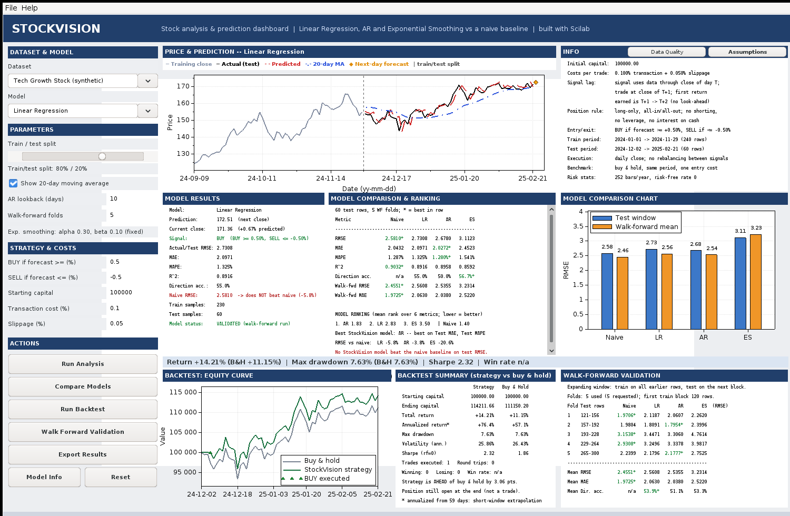

I built StockVision as an interactive Scilab desktop application for stock-market analysis, forecasting, model comparison, validation and backtesting. Version 2 turns it into a **single integrated dashboard**: controls, charts, metrics, rankings, walk-forward results and the backtest all live in one window.

**Core idea.** A prediction is not the final answer. StockVision lets a learner compare three forecasting approaches against a trivial baseline on the *same* data and test window, validate them forward in time, and see how a simple signal behaves under explicit trading assumptions. When the models do not beat the baseline, the application says so.



# 1. What StockVision does

- Loads OHLCV CSV data (three bundled synthetic datasets or a custom file), validates it and reports data quality.
- Fits **Linear Regression**, an **AR (autoregressive)** model and **Holt exponential smoothing**, plus a **naive last-value baseline**.
- Evaluates all four on one shared chronological test window with RMSE, MAE, MAPE, R^2 and directional accuracy.
- Runs expanding-window **walk-forward validation** over several folds and ranks the models from the computed results.
- Backtests the selected model's signals (long-only, with transaction cost, slippage and a one-day execution lag) against **buy and hold** over the same period.
- Exports a full text report plus CSV tables.

# 2. Why it is different

Rather than showing a single model and a single chart, StockVision makes the *evaluation* the product: a common test window for every model, a naive baseline that every model is checked against, multi-fold validation, explicit backtest assumptions on screen, and a ranking that is computed rather than asserted. It reports negative results plainly (see Section 10).

# 3. Scilab's role

Everything is core Scilab, with no toolboxes and no external dependencies:

- **GUI:** `figure`, `uicontrol` (popup menus, slider, checkbox, edit boxes, push buttons, text, listbox, frame), `uimenu`, callbacks, and `newaxes` axes embedded in the same figure as the controls.
- **Numerics:** least squares through the backslash operator, vectors/matrices for features and metrics.
- **Plotting:** `plot`, `bar`, tick/legend control inside the embedded axes.
- **I/O:** `mgetl`/`mputl`, `uiputfile`/`uigetfile`, `xs2pdf`.

# 4. Models implemented

| Model | What it is | Inputs |
|-------|--------------|-------------|
| Linear Regression | Ordinary least squares on 12 engineered features | open, high, low, close, volume, 1-day return, 5/10-day MA, 5-day volatility, lag 1-3 closes |
| AR(p) | Linear autoregression on the last *p* closes (default 10), fitted by least squares on prices scaled with training min/max | last *p* closes |
| Exponential smoothing | Holt linear trend, level + trend, fixed alpha = 0.3, beta = 0.1 (not fitted) | closing prices |
| Naive baseline | Forecast for tomorrow = today's close | closing price |

AR is a linear model. It is **not** an LSTM and not a neural network, and StockVision uses no external AI service or API. Press **Model Info** in the app for each model's purpose, assumptions and limitations.

# 5. GUI architecture

One Scilab figure; nothing opens in a separate window.

| Region | Content |
|-------|-------------------------|
| Left column | Dataset, model, split slider, MA toggle, AR lookback, walk-forward folds, BUY/SELL thresholds, capital, cost, slippage; action buttons |
| Top centre | Price and prediction chart (embedded axes) with a colour key |
| Top right | Info panel with tabs: **Data Quality** and **Assumptions** |
| Middle | Model results; comparison table with ranking; comparison bar chart |
| Strip | Backtest headline: return, drawdown, Sharpe, win rate |
| Bottom | Equity-curve chart; backtest summary; walk-forward table |
| Bottom bar | Status messages (grey = info, green = success, red = error) |

Design rules: charts are refreshed by deleting only the children of their own axes, never with `clf`/`scf`/`xdel`, so the controls always survive. Empty charts show a native "No analysis yet" placeholder. Buttons that need results (Run Backtest, Export) are disabled until a result exists. Any change that invalidates results (dataset, split, lookback, model, folds, costs) clears exactly the affected panels, so stale numbers cannot stay on screen. Errors appear in the status bar; popups are used only for real failures and for Model Info.

Code layout: `model_engine.sce` holds all modelling and text-report logic and has no GUI code; `gui_app.sce` builds widgets, holds state and renders results.

# 6. Data pipeline

1. **Load** `Date,Open,High,Low,Close,Volume` (strict header, `YYYY-MM-DD` dates, plain numbers).
2. **Validate** each row: field count, real calendar date, numeric values, non-negative volume, positive prices, Low <= Open/Close <= High. Bad rows are dropped and counted.
3. **Duplicate dates** are rejected with an error. **Unsorted files** are sorted ascending and flagged.
4. **Quality summary** is shown before modelling: rows, date range, missing values, duplicate dates, chronological order, invalid OHLC rows, training rows, testing rows.
5. **Split** chronologically (never shuffled): `split_cal = round(n * train_share)` rows before the test window.
6. **Features/scaling** are computed from training rows only; models are fitted; forecasts are produced for the test window.

# 7. Evaluation methodology

- **Common window.** Every model (LR, AR, ES, naive) is trained on calendar rows `1..split_cal` and tested on rows `split_cal+1..n`. The same dataset, split, target and metrics apply to all four. (Version 1 gave LR/AR/ES slightly different windows because warm-up rows were dropped before splitting; this is fixed.)
- **Metrics.** RMSE, MAE, MAPE (zero prices excluded), R^2, and **directional accuracy**: the share of days where the predicted move has the same sign as the actual move (zero-move days excluded; the naive forecast never moves, so it has no direction score and shows n/a).
- **Baseline check.** Each model's RMSE is compared with the naive RMSE and reported as "beats" or "does NOT beat" with the percentage difference.
- **Ranking.** Mean rank over six metrics (test RMSE, MAE, MAPE, direction accuracy, walk-forward RMSE, walk-forward MAE); ties broken by walk-forward RMSE, then test RMSE. R^2 is displayed but not ranked separately because on a single window it orders models exactly like RMSE. If the top two StockVision models differ by under 1% RMSE the panel flags a near-tie. The ranking text is generated from the computed numbers; nothing is hard-coded.

# 8. Leakage prevention

- Scaling means/standard deviations (LR) and the price range (AR) come from training rows only.
- A forecast for day *t* uses data up to day *t-1* only; ES forecasts use the state built before day *t*.
- The backtest books each day's return before evaluating that day's signal and delays execution by one day.
- Walk-forward folds run on data **truncated at the end of each fold**, so later rows do not exist for the models.
- Tests: perturbing every price after day *k* leaves all forecasts up to day *k* unchanged for all four models; perturbing the last fold leaves folds 1-4 unchanged; LR coefficients and scaling are unaffected by test-period prices.

# 9. Walk-forward validation

Expanding window: train on all earlier rows, test on the next block, then move forward. The first training block is `max(40% of rows, 40, lookback+30)` rows and every fold needs at least 10 test rows. The default is 5 folds. If the dataset cannot support the requested number the app **reduces the count automatically and states why** (for example, 10 requested folds on the 118-row demo file become 7); if even one fold is impossible it refuses rather than fabricating folds. The panel shows each fold's RMSE for every model and the mean RMSE, MAE and direction accuracy.

# 10. Backtesting assumptions and buy-and-hold benchmark

These are shown on screen (Info panel > Assumptions) and exported:

- Initial capital (default 100,000); transaction cost (default 0.10%) and slippage (default 0.05%) deducted from equity on every executed BUY and SELL.
- **Signal lag.** A signal uses data through the close of day T; the trade executes at the close of T+1; the first return earned is T+1 to T+2.
- Long-only, all-in/all-out. BUY if forecast change >= +0.5%, SELL if <= -0.5%, otherwise hold. No shorting, no leverage, no interest on cash, no rebalancing between signals.
- Evaluation period = the test window; training period precedes it. Daily closing prices.
- **Buy and hold** uses the same period and pays one entry cost under the same cost assumptions. Maximum drawdown, volatility and Sharpe are reported for both (252 bars per year, risk-free rate 0).
- Reported: starting/ending capital, total return, annualized return (only if at least 30 days; labelled as a short-window extrapolation), max drawdown, volatility, Sharpe, trades executed, winning and losing round trips, win rate. A position still open at the end is noted and not counted as a trade.

## What the bundled data shows (real output of `generate_sample_outputs.sce`)

Settings: 80/20 split, AR lookback 10, ES alpha 0.3 / beta 0.1, 5 folds. Lower RMSE is better.

| Dataset (synthetic) | Metric | Naive | LR | AR | ES |
|---|---|---|---|---|---|
| Tech Growth Stock | Test RMSE | 2.5810 | 2.7308 | 2.6780 | 3.1123 |
| | Walk-forward mean RMSE | 2.4551 | 2.5608 | 2.5355 | 3.2314 |
| Blue Chip Stock | Test RMSE | 1.6822 | 1.7692 | 1.7775 | 2.7713 |
| | Walk-forward mean RMSE | 1.8542 | 2.0941 | 2.1382 | 2.6448 |
| Volatile Stock | Test RMSE | 5.6014 | 6.7955 | 6.5915 | 8.3150 |
| | Walk-forward mean RMSE | 3.7203 | 4.0955 | 3.9121 | 5.1572 |


- **Tech Growth Stock**: best StockVision model by mean rank = AR -- best on Test MAE, Test MAPE; No StockVision model beat the naive baseline on test RMSE.
- **Blue Chip Stock**: best StockVision model by mean rank = LR -- best on Direction accuracy; No StockVision model beat the naive baseline on test RMSE.
- **Volatile Stock**: best StockVision model by mean rank = AR -- best on Direction accuracy; No StockVision model beat the naive baseline on test RMSE.

**Interpretation.** On all three bundled synthetic series the naive baseline has the lowest test RMSE and the lowest walk-forward RMSE and MAE. On Tech Growth, AR has marginally lower single-split MAE and MAPE; on the other two datasets the naive baseline is best on every single-split error metric. Several directional accuracies are at or below 50%. This is consistent with price series that are close to a random walk, where yesterday's price is hard to beat, although the statistical properties of the bundled data were not tested formally. StockVision reports this rather than hiding it, which is the purpose of a transparent comparative evaluation.

**About the sample backtest.** In this illustrative backtest, the strategy returned 14.21% versus 11.15% for buy-and-hold. The result is based on a single trade (one BUY, still open at the end of a 59-day window) and should not be interpreted as evidence of predictive superiority. Real-market behaviour may differ, and the bundled data is synthetic.

# 11. Limitations

- Bundled datasets are synthetic; no live market data. Educational tool, **not investment advice**.
- One fixed train/test split for the headline metrics; walk-forward uses five folds on 300 rows. Results are noisy and no significance tests are run.
- The AR lookback and ES alpha/beta are user-chosen or fixed, not tuned; LR uses all 12 features with no regularization.
- The backtest covers a short window (typically 60 days), is long/cash only, and omits bid/ask spread, partial fills, intraday moves and market impact. Annualized figures from short windows are extrapolations.
- The "rough 95% band" in exports is a normal approximation from training residuals, not a true prediction interval.
- Verified on Scilab 2024.0.0 (Linux, virtual display). Windows and other Scilab-version compatibility has not been independently verified. The dashboard is laid out for about 1500 x 980 px; on smaller screens text panels scroll.

# 12. How to run

1. Install Scilab (no toolboxes needed).
2. In Scilab, change directory to `01_Source_Code/scilab_gui_app` and run:

```
exec("gui_app.sce", -1);
```

Tests (headless): `scilab-cli -nb -f test_model_engine.sce` prints PASS/FAIL per check. GUI workflow test (needs a display): `xvfb-run -a scilab -nw -nb -f test_gui_workflow.sce`. Regenerate sample outputs: `scilab-cli -nb -f generate_sample_outputs.sce`.

# 13. How to use

1. Pick a dataset and model; check the Data Quality tab.
2. Optionally adjust split, AR lookback, thresholds, costs and slippage.
3. **Run Analysis** to see the forecast, metrics and chart in the main window.
4. **Compare Models** for the four-way table, ranking and chart; **Walk Forward Validation** for per-fold results.
5. **Run Backtest** for strategy vs buy and hold; the Assumptions tab shows exactly what was simulated.
6. **Export Results** (.txt report + CSVs, .csv, or .pdf with the three charts only); **Model Info** for assumptions; **Reset** to start over.

# 14. Expected outputs

`outputs/` and `06_Sample_Outputs/` hold reproducible files generated by the engine: `sample_prediction.csv`, `sample_backtest.csv`, `sample_prediction_exponential_smoothing.csv`, `sample_comparison.txt` (and `sample_outputs.txt`). The Export button writes a timestamped report with data quality, parameters, results, comparison, ranking, walk-forward, assumptions and backtest, plus predictions, comparison, walk-forward and backtest CSV tables. The `.pdf` option exports the three embedded charts only, at their window positions (no text panels, no colour key). Existing files are never overwritten; a free `_2`, `_3` name is chosen.

# 15. Verification summary

- Engine tests: **263 checks, 0 failures** (original tests retained, new tests for validation, leakage, common window, naive baseline, comparison/ranking, walk-forward, costs, slippage, lag, drawdown, Sharpe, buy and hold, exports).
- GUI workflow test: **41 checks, 0 failures**, driving the real callbacks in a live Scilab GUI (single window, stale-state clearing, button states, validation, export, reset, bad CSV).
- Regenerating sample outputs reproduces identical numbers (only the export timestamp differs).
- Not verified: Windows or other Scilab versions; pixel-level appearance (screenshots were captured from the running app, not compared automatically).

# 16. Changes based on hackathon feedback

1. **Integrated dashboard.** Plots and results used to open in separate windows. All three charts and every result panel are now embedded in the main window; no separate chart window is opened.
2. **Concise code comments.** Verbose comment blocks were substantially reduced and replaced with short purpose and assumption notes.
3. **Stronger model comparison.** One shared test window for all models, five metrics plus walk-forward metrics, best value per metric highlighted, and a ranking computed from the numbers.
4. **More rigorous backtesting.** Explicit signal/execution lag, costs and slippage on every trade, net-of-cost trade returns, winning/losing counts, annualized return, volatility and Sharpe for both strategy and benchmark.
5. **Naive baseline.** A last-value forecast is evaluated on the same window and every model is explicitly reported as beating it or not.
6. **Buy-and-hold benchmark.** Same period, same cost assumptions, with return, drawdown and Sharpe side by side.
7. **Walk-forward validation.** Multiple expanding-window folds on truncated data, automatic fold reduction with a stated reason, per-fold and mean metrics.
8. **Explicit assumptions.** A visible Assumptions panel, a data-quality panel, and a rewritten Model Info that states assumptions and limitations per model.
9. **Improved UX.** Section headings, consistent layout, status bar with progress and error messages, "No analysis yet" states, disabled buttons when prerequisites are missing, tooltips, and no routine popups.

# 17. Files

```
01_Source_Code/scilab_gui_app/  gui_app.sce  model_engine.sce  test_model_engine.sce
                                test_gui_workflow.sce  generate_sample_outputs.sce
                                MANUAL_TEST_CHECKLIST.md  sample_data/  outputs/  tools/
02_Documentation/  StockVision_README.pdf  StockVision_Project_Report.pdf  source/ (Markdown + CSS + build script for the PDFs)
03_Demo_Video/  Scilab_demo_video.mp4 (1:48 captioned screen recording, no voice-over)  DEMO_VIDEO_SCRIPT_V2.md
04_Problem_Statement/  StockVision_Problem_Statement.pdf
05_GUI_Screenshots/  01..09 PNG        06_Sample_Outputs/  CSV/TXT samples
```

`sample_data/messy_demo_data_quality.csv` is a new demo file (118 usable rows, newest-first, one missing value, one impossible bar) used to show the data-quality counters; the three original datasets are unchanged. `tools/` holds the scripts used to capture the screenshots and demo video.

# 18. License

MIT (see `LICENSE`).
